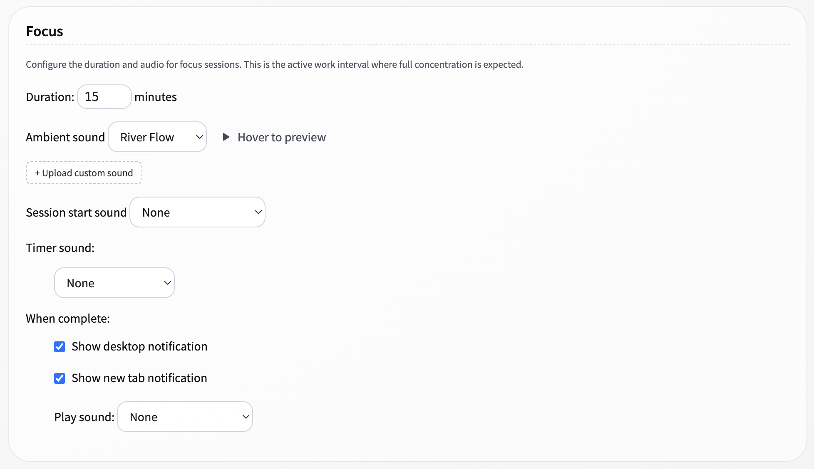
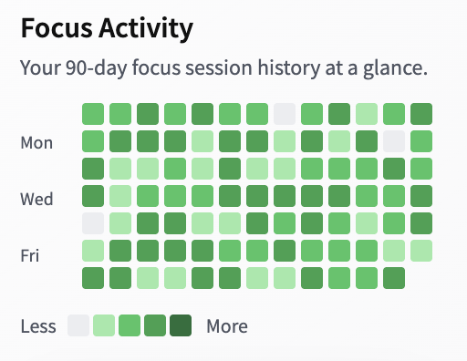
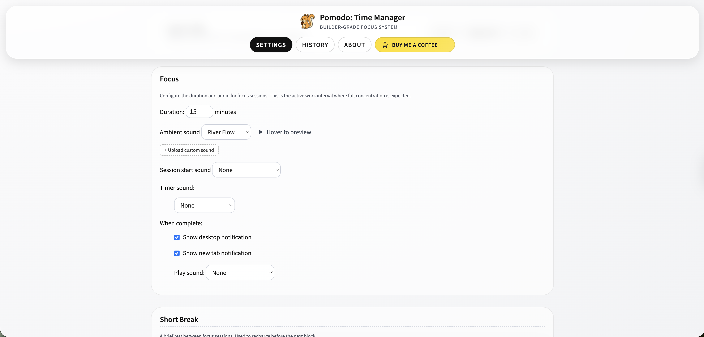

# Pomodo: Time Manager (Feedback & Support)

Pomodo is a privacy-first focus timer and productivity companion for Chrome.

[Install from Chrome Web Store](https://chromewebstore.google.com/detail/pomodo-time-manager/igiohnhaahnhmlioghdcolbhhhfgnoek)

## Quick Support

- Report a bug: [Open Bug Report](https://github.com/ambicuity/pomodo-feedback/issues/new?template=bug_report.yml)
- Request a feature: [Open Feature Request](https://github.com/ambicuity/pomodo-feedback/issues/new?template=feature_request.yml)
- Browse all issues: [Issues Board](https://github.com/ambicuity/pomodo-feedback/issues)
- Privacy details: [Privacy Policy](PRIVACY.md)

## Screenshot Gallery

## Media Kit

- Icons: `assets/icons/`
- Screenshots: `assets/screenshots/`
- Promotional Tiles: `assets/promotional/`

### Included Files

- `assets/icons/icon-16.png`
- `assets/icons/icon-48.png`
- `assets/icons/icon-128.png`
- `assets/icons/browser-action.png`
- `assets/screenshots/focus.png`
- `assets/screenshots/stats-1.png`
- `assets/screenshots/stats-2.png`
- `assets/screenshots/settings.png`
- `assets/screenshots/menu.png`
- `assets/screenshots/break.png`
- `assets/promotional/tile-440x280.png`
- `assets/promotional/tile-920x680.png`
- `assets/promotional/tile-1400x560.png`

## Public Documents

- [Contributing Guide](CONTRIBUTING.md)
- [Changelog](CHANGELOG.md)
- [Attributions](ATTRIBUTION.md)
- [License](LICENSE.md)
- [Contributors](CONTRIBUTORS.md)

Maintainer: Ritesh Rana (`contact@riteshrana.engineer`)

## Ops Secrets

Internal automation in this repository expects these Actions secrets:

- `POMODO_SYNC_TOKEN`: cross-repo issue mirror and close sync with `ambicuity/pomodo`.
- `COPILOT_GITHUB_TOKEN`: required by the `Daily Repo Status` workflow engine.

## AI Review Policy

- Gemini Code Assist is the default reviewer for normal PR guidance in this public feedback repository.
- CodeRabbit is used as targeted backup when Gemini signals uncertainty or when changes affect higher-risk areas (workflows, templates, security-impact logic).
- Free OSS mode is used here for CodeRabbit; linked private-repository analysis requires CodeRabbit Pro.
